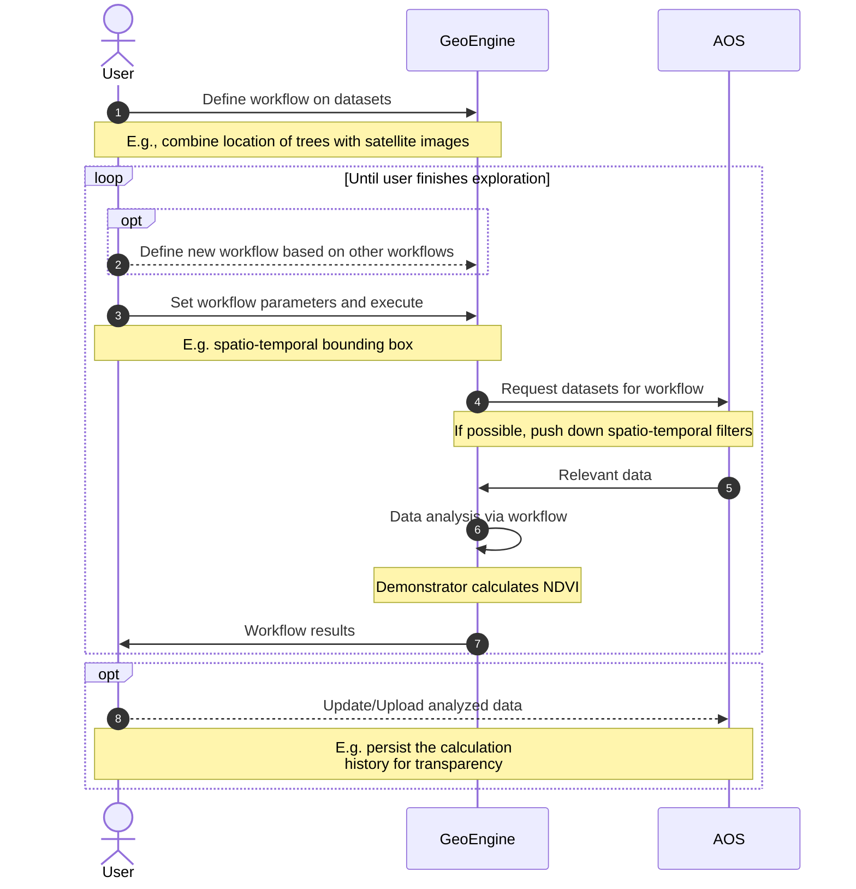

```mermaid
sequenceDiagram
    autonumber
    actor User
    participant GeoEngine
    participant AOS

    User ->> GeoEngine: Define workflow on datasets
    Note over GeoEngine,User: E.g., combine location of trees with satellite images

    loop Until user finishes exploration
    opt
    User -->> GeoEngine: Define new workflow based on other workflows
    end
    User ->> GeoEngine: Set workflow parameters and execute
    Note over User,GeoEngine: E.g. spatio-temporal bounding box
    GeoEngine ->> AOS: Request datasets for workflow
    Note over GeoEngine,AOS: If possible, push down spatio-temporal filters
    AOS ->> GeoEngine: Relevant data
    GeoEngine ->> GeoEngine: Data analysis via workflow
    Note over GeoEngine,GeoEngine: Demonstrator calculates NDVI
    GeoEngine ->> User: Workflow results
    end

    opt
    User -->> AOS: Update/Upload analyzed data
    Note over User,AOS: E.g. persist the calculation<br/>history for transparency
    end
```