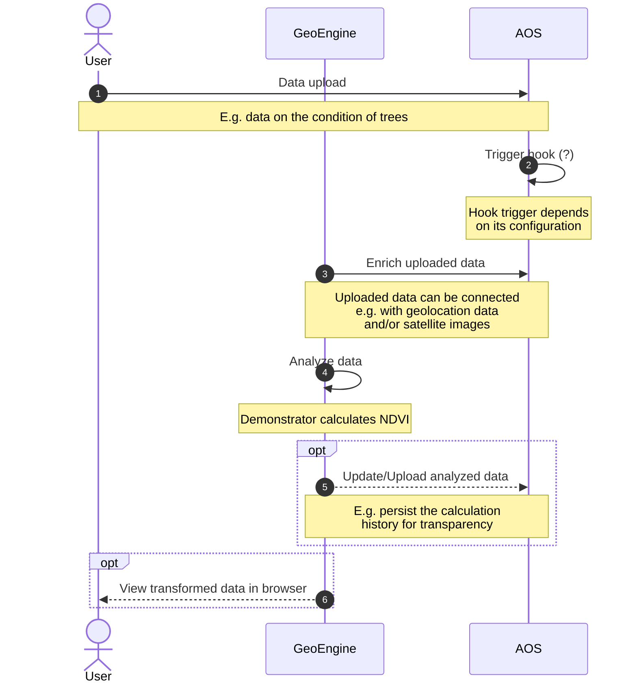

```mermaid
sequenceDiagram
    autonumber
    actor User
    participant GeoEngine
    participant AOS

    User ->> AOS: Data upload
    Note over User,AOS: E.g. data on the condition of trees

    AOS->>AOS: Trigger hook (?)
    Note over AOS,AOS: Hook trigger depends<br/>on its configuration

    GeoEngine ->> AOS: Enrich uploaded data
    Note over GeoEngine,AOS: Uploaded data can be connected<br/>e.g. with geolocation data<br/>and/or satellite images

    GeoEngine ->> GeoEngine: Analyze data
    Note over GeoEngine,GeoEngine: Demonstrator calculates NDVI

    opt
    GeoEngine -->> AOS: Update/Upload analyzed data
    Note over GeoEngine,AOS: E.g. persist the calculation<br/>history for transparency
    end

    opt
    GeoEngine -->> User: View transformed data in browser
    end
```