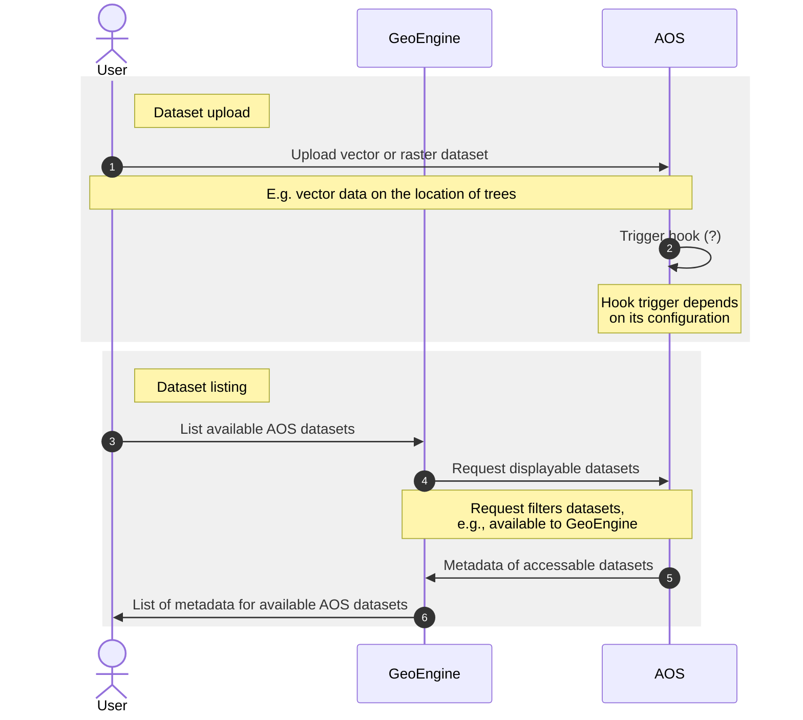

```mermaid
sequenceDiagram
    autonumber
    actor User
    participant GeoEngine
    participant AOS

    rect rgb(240, 240, 240)
    note right of User: Dataset upload
    User ->> AOS: Upload vector or raster dataset
    Note over User,AOS: E.g. vector data on the location of trees

    AOS->>AOS: Trigger hook (?)
    Note over AOS,AOS: Hook trigger depends<br/>on its configuration
    end

    rect rgb(240, 240, 240)
    note right of User: Dataset listing
    User ->> GeoEngine: List available AOS datasets
    GeoEngine ->> AOS: Request displayable datasets
    Note over GeoEngine,AOS: Request filters datasets, <br/> e.g., available to GeoEngine
    AOS ->> GeoEngine: Metadata of accessable datasets
    GeoEngine ->> User: List of metadata for available AOS datasets
    end
```