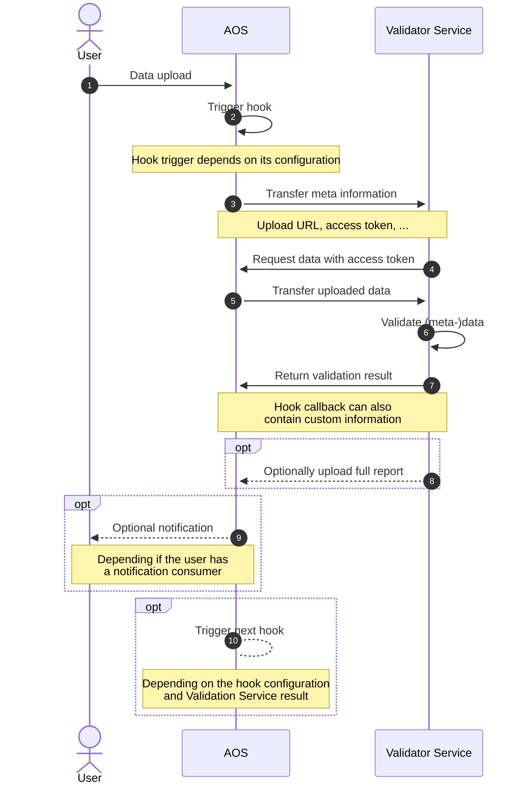

```mermaid
sequenceDiagram
    autonumber
    actor User
    User->>+AOS: Data upload

    AOS->>AOS: Trigger hook 
    Note over AOS,AOS: Hook trigger depends on its configuration

    AOS->>+Validator Service: Transfer meta information
    Note over AOS,Validator Service: Upload URL, access token, ...

    Validator Service->>AOS: Request data with access token
    AOS->>Validator Service: Transfer uploaded data

    Validator Service->>Validator Service: Validate (meta-)data

    Validator Service->>AOS: Return validation result
    Note over Validator Service,AOS: Hook callback can also<br/>contain custom information

    opt
    Validator Service-->>AOS: Optionally upload full report
    end 

    opt
    AOS-->>User: Optional notification
    Note over AOS,User: Depending if the user has<br/>a notification consumer
    end

    opt
    AOS-->AOS: Trigger next hook
    Note over AOS,AOS: Depending on the hook configuration<br/>and Validation Service result
    end
```