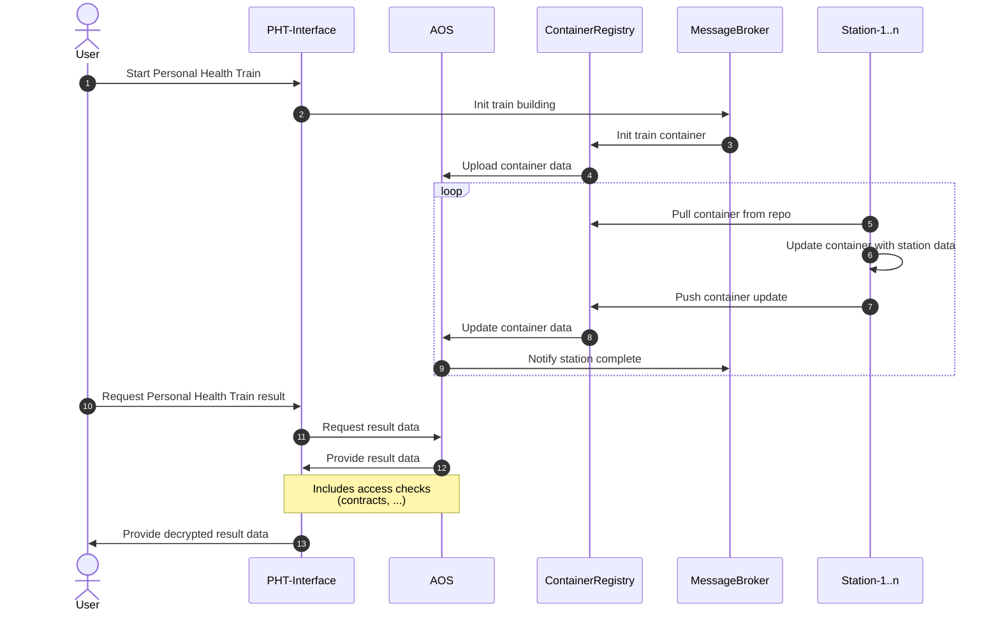

```mermaid
sequenceDiagram
    autonumber
    actor User
    participant PHT-Interface
    participant AOS
    participant ContainerRegistry
    participant MessageBroker
    participant Station-1..n

    User ->> PHT-Interface: Start Personal Health Train
    PHT-Interface ->> MessageBroker: Init train building
    MessageBroker ->> ContainerRegistry: Init train container
    ContainerRegistry ->> AOS: Upload container data
    
    loop
    Station-1..n ->> ContainerRegistry: Pull container from repo
    Station-1..n ->> Station-1..n: Update container with station data
    Station-1..n ->> ContainerRegistry: Push container update
    ContainerRegistry ->> AOS: Update container data
    AOS ->> MessageBroker: Notify station complete
    end

    User ->> PHT-Interface: Request Personal Health Train result

    PHT-Interface ->> AOS: Request result data

    AOS ->> PHT-Interface: Provide result data
    Note over AOS,PHT-Interface: Includes access checks<br/>(contracts, ...)

    PHT-Interface ->> User: Provide decrypted result data
```