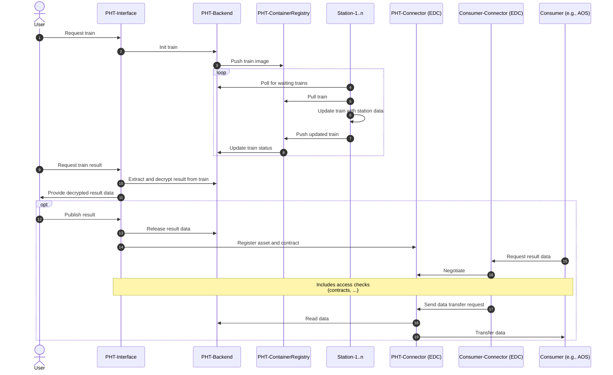

```mermaid
sequenceDiagram
    autonumber
    actor User
    participant PHT-Interface
    participant PHT-Backend
    participant PHT-ContainerRegistry
    participant Station-1..n
    participant PHT-Connector as PHT-Connector (EDC)
    participant AOS-Connector as Consumer-Connector (EDC)
    participant AOS as Consumer (e.g., AOS)

    User ->> PHT-Interface: Request train
    PHT-Interface ->> PHT-Backend: Init train
    PHT-Backend ->> PHT-ContainerRegistry: Push train image
    
    loop
    Station-1..n ->> PHT-Backend: Poll for waiting trains
    Station-1..n ->> PHT-ContainerRegistry: Pull train
    Station-1..n ->> Station-1..n: Update train with station data
    Station-1..n ->> PHT-ContainerRegistry: Push updated train
    PHT-ContainerRegistry ->> PHT-Backend: Update train status
    end

    User ->> PHT-Interface: Request train result
    PHT-Interface ->> PHT-Backend: Extract and decrypt result from train
    PHT-Interface ->> User: Provide decrypted result data
    
    opt

    User ->> PHT-Interface: Publish result
    PHT-Interface ->> PHT-Backend: Release result data
    PHT-Interface ->> PHT-Connector: Register asset and contract

    AOS ->> AOS-Connector: Request result data
    AOS-Connector ->> PHT-Connector: Negotiate
    Note over AOS,PHT-Interface: Includes access checks<br/>(contracts, ...)
    AOS-Connector ->> PHT-Connector: Send data transfer request
    PHT-Connector ->> PHT-Backend: Read data
    PHT-Connector ->> AOS: Transfer data

    end
```